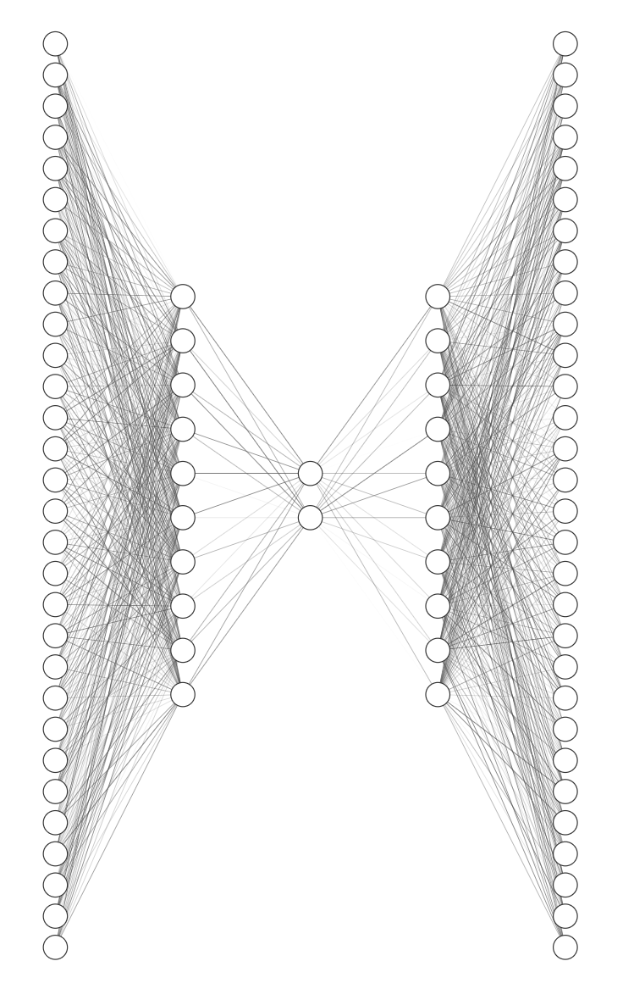
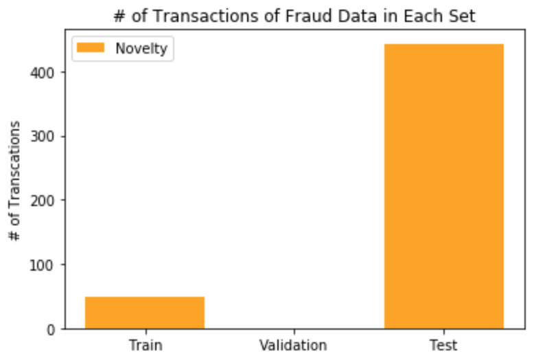
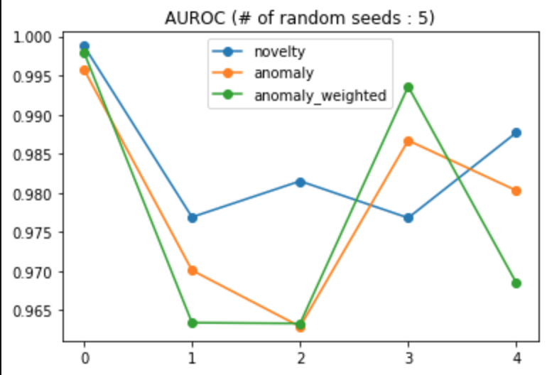
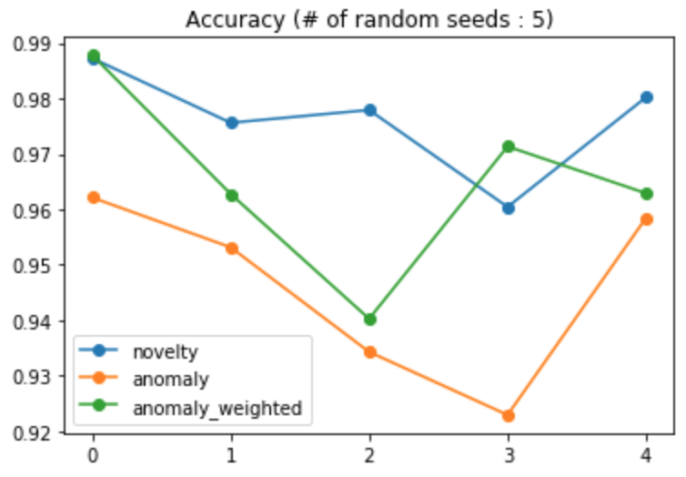
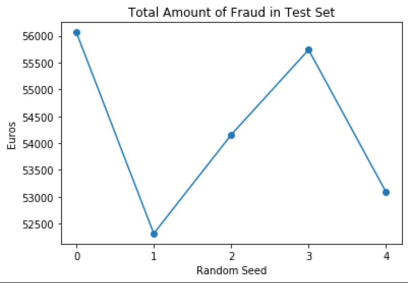
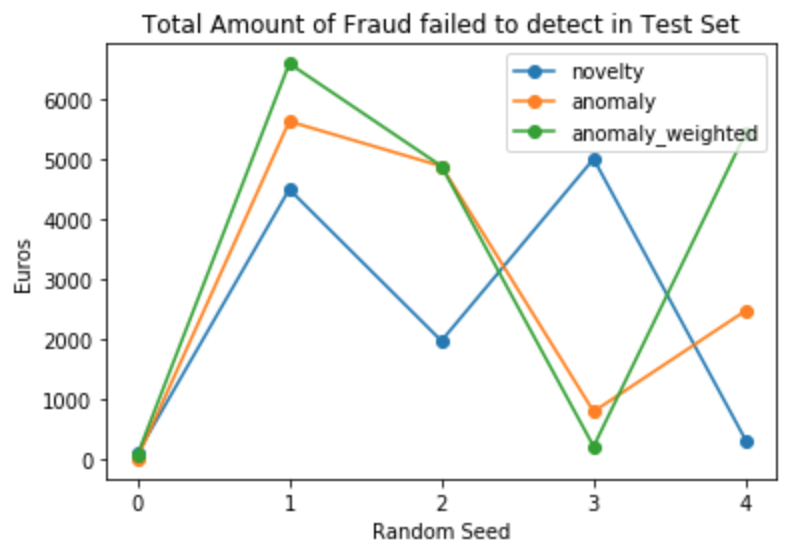
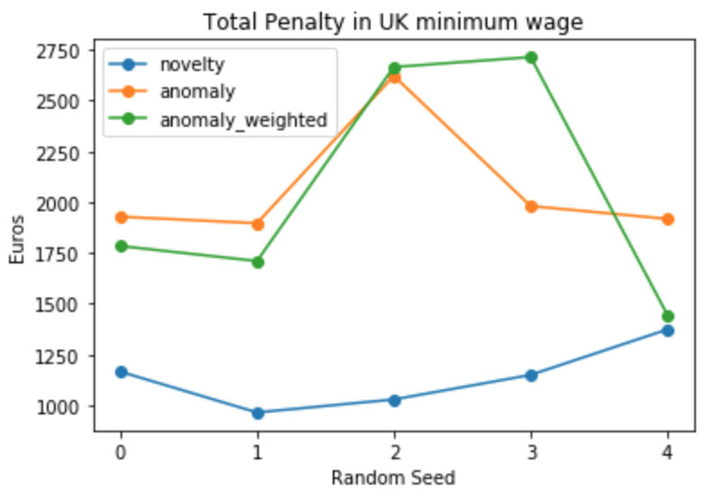
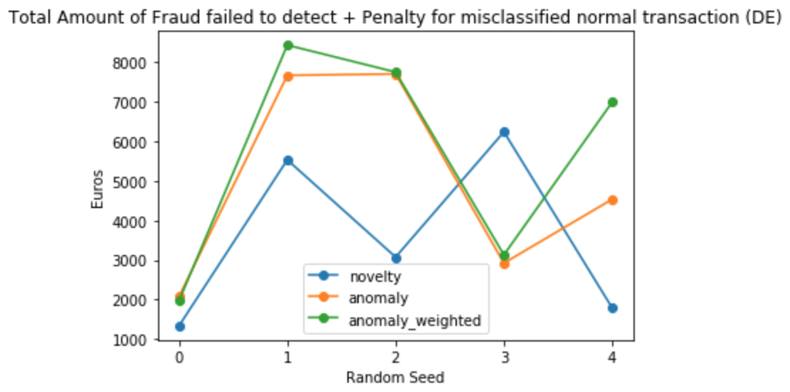
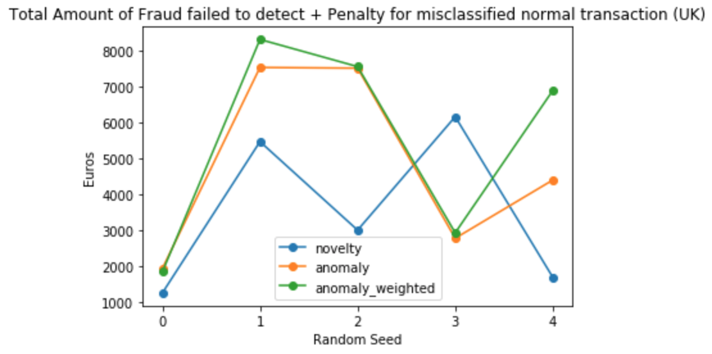

# Credit Fraud Detection System

## Abstract

**Use total damage and peanlty for false alarm for model evaluation, perform anomaly detection to make model learn which fraud causes bigger damage**

## Summary

- Inspired by [2019 Edelman Finalist Microsoft : Prospective Dynamic Fraud Control for Optimal Profitability in e-Commerce](https://www.informs.org/Resource-Center/Video-Library/Edelman-Competition-Videos/2019-Edelman-Competition-Videos/2019-Edelman-Finalist-Microsoft)
- From video, the importance of model management and reducing total damage from fraud are discussed
- [Previous work : Credit Fraud Detection Model](https://github.com/hyeon95y/Credit_Card_Fraud_Detection) only concerned about AUROC, not total damage amount from fraud
  - As it only concerned about AUROC, there was no bigger penalty for fraud case which caused bigger damage
  - As model was trained as a novelty detection problem (model only learns normal sample while required to reject novelty in test set), model had no chance to learn which fraud causes bigger damage

## Objective

**Reduce total damage while keeping AUROC**

- Set problem as anomaly detection, so that model can learn fraud which has higher potential damage
- Metric for model evaluation
  - Total damage from fraud failed to detect + Penalty for false detection
- Loss Function
  - Minimize reconstructoin error and KL Divergence for normal sample
  - (Model 2) Maxmize reconsturciton error for fraud sample
  - (Model 3) Maximize reconsturction error for fraud sample * fraud amount
- Penalty for false detection
  - Calculated as minmium wage per hour / (60 mins / minutes needed to make a call to check)
    - Penalty for false detection in DE : €0.7658 per a call
      - [Minimum wage in DE](https://www.google.com/search?client=safari&rls=en&q=germany+hourly+pay&ie=UTF-8&oe=UTF-8)
          - €9.19
    - Penalty for false detection in UK : €0.7108 per a call
      - [Minimum wage in UK](https://www.gov.uk/national-minimum-wage-rates)
          - 25 and over : £8.21
          - 21 to 24 : £7.70
          - 18 to 20 : £6.15
      - [Pound_to_Euros](https://www.google.com/search?client=safari&rls=en&sxsrf=ACYBGNTcBXXo56cjcxGtjvDJsYxVHAIsXQ%3A1571206181009&ei=JbSmXdsWhKSYBZqkl7AP&q=pound+euro+exchange+rate&oq=pound+euro+exchange+rate&gs_l=psy-ab.3..0i203l10.58549.61738..61805...1.0..0.475.3739.0j21j4-2......0....1..gws-wiz.......35i39j0j0i131j0i67j0i131i67j0i20i263j0i10i203.12vb-27mARs&ved=0ahUKEwibvaaSj6DlAhUEEqYKHRrSBfYQ4dUDCAo&uact=5)(2019.10.19)
          - £1 = €1.16
    - Time required to make a call and check transaction is done by owner or not : 5 minutes (arbitrary set)

## About Models

**Fully Connected Variational Autoencoder**

* Simple structure with 30 -> 10 -> 2 -> 10 -> 30
* In this project, 3 methods are tested with same structure above
  * Model 1 : Novelty Detection
    * Trained by normal samples only
    * Loss function
      * Minimize reconsturction error for normal sample
      * Minimize KL Divergence for normal sample
  * Model 2 : Anomaly Detection
    * Tained by normal sample + fraud sample
    * Loss function
      * Minimize reconstruction error for normal sample
      * Minimize KL Divergence for normal sample
      * Maximize reconstruction error for fraud sample
  * Model 3 : Anomaly Detection with Fraud Amount Weighted Loss
    * Trained by normal sample + fraud sample
    * Looss function
      * Minimize reconstruction error for normal sample
      * Minimize KL Divergence for normal sample
      * Maximize **reconstruction error * fraud amount** for fraud sample (**assign bigger weight for bigger damage**)

## Result

**Training proposed method is unstable, only in some random seed it showed better performance**

- Each method was tested for 5 random seeds
- Used data from [Kaggle : Credit Card Fraud Detection](https://www.kaggle.com/mlg-ulb/creditcardfraud)
- Data was splitted as below

### AUROC

### Accuracy

### Total Amount of Fraud in Test Set

### Total Damage in Test Set (Failed to detect)

### Total Penalty (False Alaram for detection x Cost to make a call for check)

### Total Loss (Damage + Penalty) (in DE minimum wage)

### Total Loss (Damage + Penalty) (in UK minimum wage)

